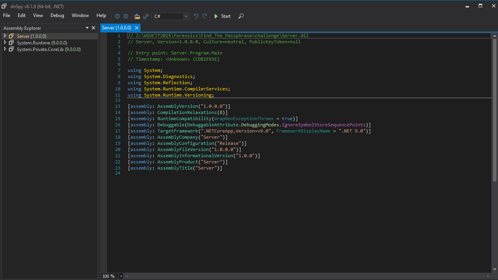
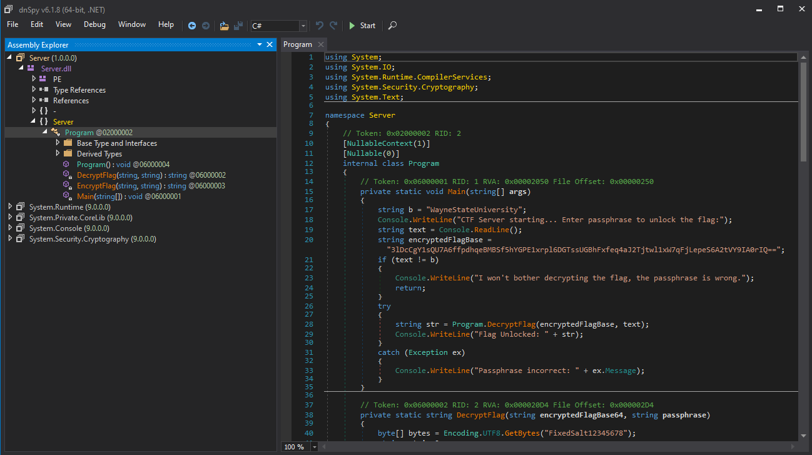
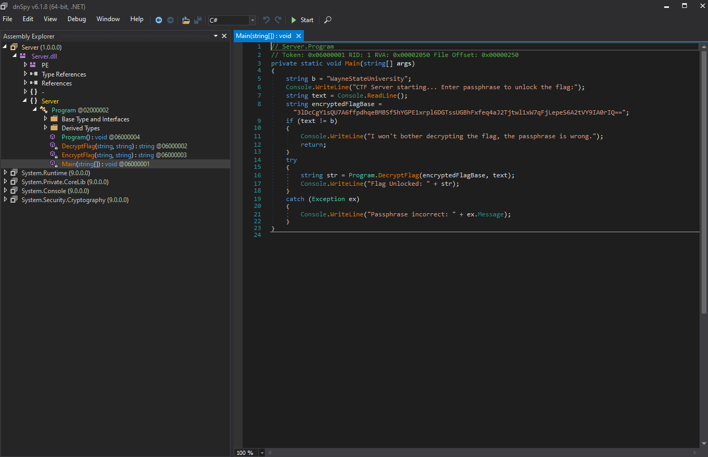
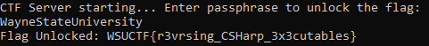

# 🏴 Find The Passphrase

**Category:** Forensics
**Points:** 10 pts
**Author:** Sebastian
**Description:** Can you reverse engineer this dll to find the passphrase in order to retrieve the flag?

---

## Purpose

The purpose of this challenge was to get used to using tools to decompile windows executables or dll files. In this challenge, you are given a Server.dll file, along with a Server.runtimeconfig.json file. In the challenge description, it mentions that we have to reverse engineer the dll.

## Exploitation

One tool that is good to use to decompile windows binaries is [dnSpy](https://github.com/dnSpy/dnSpy).

If you decompile the dll file with this tool you can see this:



In order to look into the functions of the .net executable, you have to click into the Server file dropdown. Eventually, you get to this:



If we look into the EncryptFlag, DecryptFlag, and Main functions, we can see that the flag is encrypted using an AES algorithm. In this challenge, all you have to do is call the DecryptFlag function. The function already works to decrypt the AES cipher with the key, so you don't have to be concerned with figuring out how to decrypt ciphertext using the algorithm with a key.

If we look at the main function, we see that there is an encrypted flag, and if we pass in a valid passphrase, then the program will attempt to decrypt the flag for us. All we have to do now is get the passphrase and give it to the program.



We know we have the correct passphrase when the if statement that returns from the programming is not called. This means that we need to enter the passphrase "WayneStateUniversity"

## Solution

If we enter the correct passphrase, we get the decrypted flag:



flag: ```WSUCTF{r3vrsing_CSHarp_3x3cutables}```