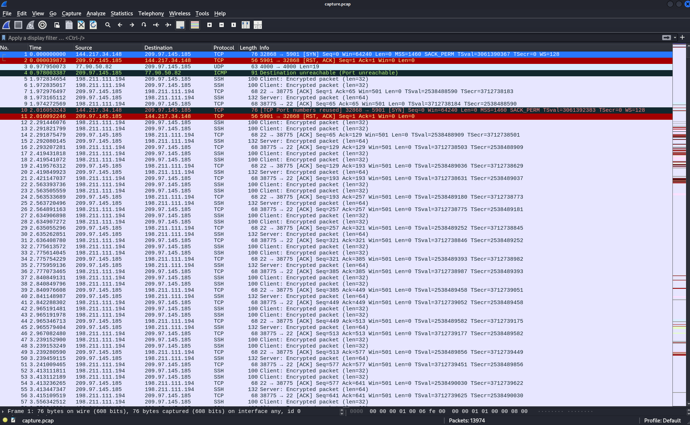
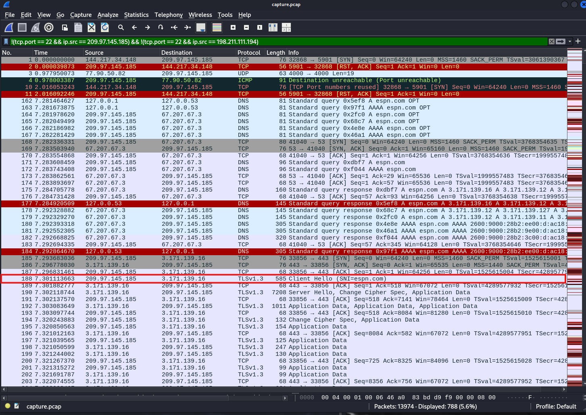
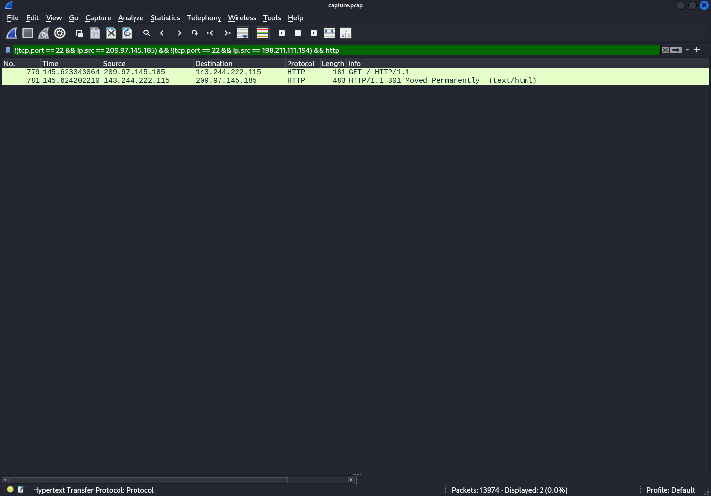
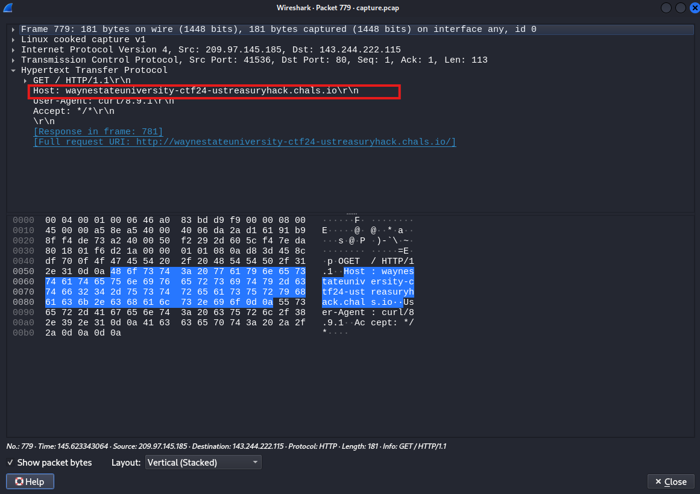
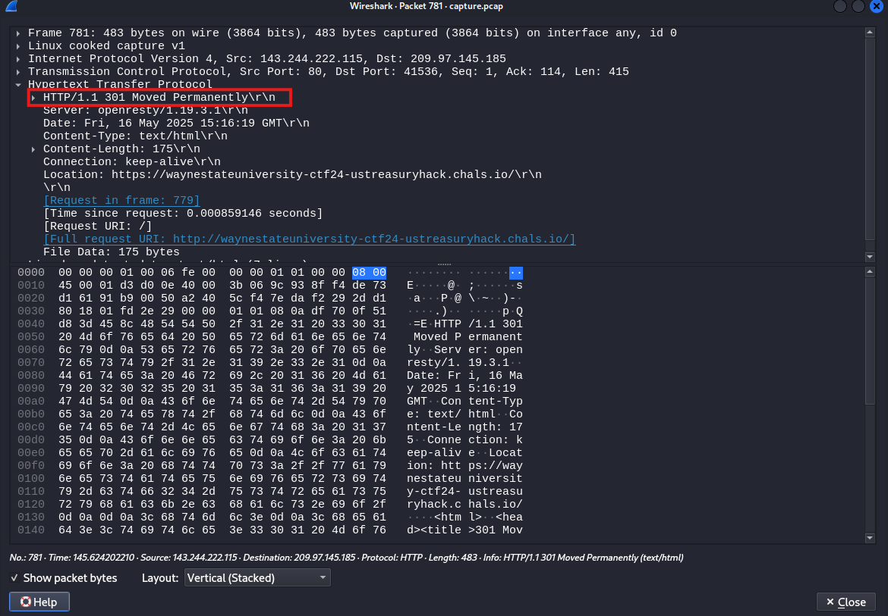
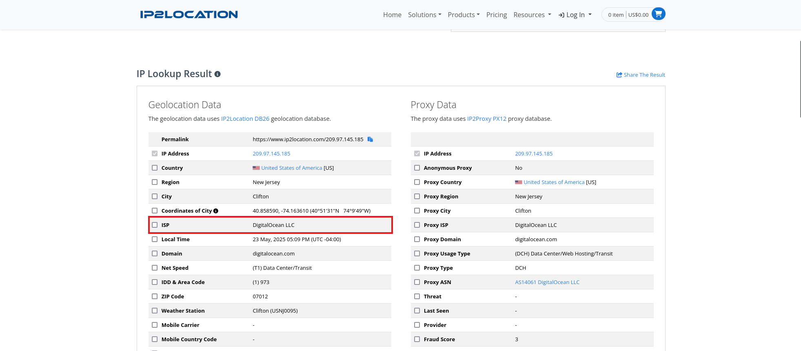

# 🏴 Suspicious Web Traffic

> **Category:** Forensics
> **Points:** 15 pts
> **Author:** Sebastian
> **Description:** One of our employees has been surfing the web a lot lately. Can you help us figure out if he is up to anything suspicious?

---

## Purpose

The purpose of this challenge was to get introduced to analyzing packet captures with Wireshark. This challenge involved a pcap file and a remote server to connect to using netcat that asks you questions about the packet capture file. If you answer all of the questions correctly, you get the flag.

## Exploitation

The intended tool to use for this challenge is [Wireshark](https://www.wireshark.org/download.html). If we open the packet capture in wireshark, we see network traffic.



The first thing that comes to mind is that there is a lot of SSH connections to and from the same two ip addresses, so one way to simplify this packet capture is to filter all of that traffic out by applying a filter like this:

```
!(tcp.port == 22 && ip.src == 209.97.145.185) && !(tcp.port == 22 && ip.src == 198.211.111.194)
```

**Question 1**

```
What is the first website that the user visited? Look carefully — the user visited both HTTP and HTTPS websites. Please enter the entire domain name including the protocol (http:// or https://).
```

After filtering the traffic, if we look at the top of the packet capture, you can see there is DNS traffic that queries espn.com. 

Also if you look further down the packet capture, you will see a TLSv1.3 packet. This is a packet for the HTTPS TLS handshake, and you will see the SNI (Server Name Indication) set to espn.com. The SNI shows you which hostname was requested for an HTTPS request. Therefore, https://espn.com is the first answer.



**Question 2**

```
There was only one HTTP request made in the packet capture. To which IP address did the user make the request?
```

For this, all we have to do is filter for only HTTP packets:



The answer is 143.244.222.115

**Question 3**

```
What is the host associated with this IP address? Please enter the entire domain name including the protocol (http://).
```

We can find the hostname by clicking into the http packet.



Answer: http://waynestateuniversity-ctf24-ustreasuryhack.chals.io

**Question 4**

```
What is the response code that was sent back from the server in the HTTP response?
```

We can find the response code by clicking into the response packet that the server sends back.



Answer: 301

**Question 5**

```
What cloud provider service was most likely used to create this packet capture? To find this, research where some of the common IP addresses originate from. Submit the name of the provider as one word, with only the first letter capitalized.
```

In order to find the answer to this, you have to do some Googling on the ip addresses that come from the packet capture. After doing some research on websites that can be used for ip lookups, one good option is [ip2location](https://www.ip2location.com/).

We should lookup the ip address that is being used to make all of the web requests because that is for sure the ip address of the user: 209.97.145.185.

After doing this, we find out that this ip address comes from a Digitalocean ISP.



Answer: Digitalocean

## Solution

[flag](./flag.png)

flag: ```WSUCTF{1_am_a_Wireshark_m4ster}```