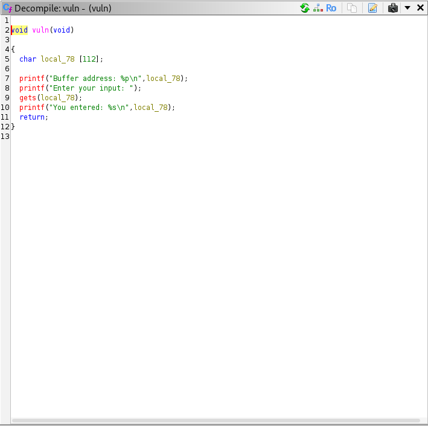
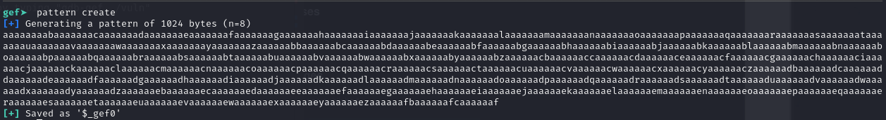
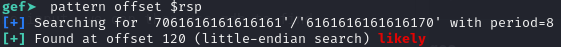
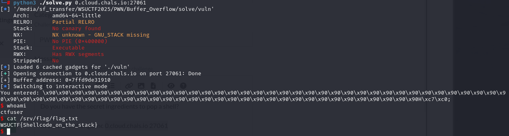

# 🏴 Buffer Overflow

> **Category:** Pwn
>
> **Points:** 20 pts
>
> **Author:** Sebastian
>
> **Description:** Do you have the secret ingredients to pop a shell?

---

## Purpose

The purpose of this challenge was to have ctf players do a ret2shellcode, and find a way to create a shell when the stack is marked as executable, and when you are given a leak to the address where your buffer is placed on the stack.

## Exploitation

It is recommended to always decompile binaries when you are given them in PWN challenges, so you can understand exactly what the executable is doing before you even run the file. You can use [Ghidra](https://github.com/NationalSecurityAgency/ghidra) to decompile a vulnerable linux ELF executable.

I would also recommend downloading a debugger. The one I really recommend is downloading the gdb-peda-pwndbg bundle that you can get from this [github](https://github.com/apogiatzis/gdb-peda-pwndbg-gef).

If we look into the ghidra decompilation, the main function outputs a welcome message and calls the vuln function. Inside of the vuln function we see this:



This function is vulnerable because it allocates 112 bytes for the user to input into the program, but it uses the gets() function from libc, which is vulnerable. gets() will accept an input of any length from the user until a newline character ("\n")is sent, and it will attempt to put that supplied input into a buffer that is 112 bytes long. Therefore, if we enter more than 112 bytes, we should see a buffer overflow where some of the memory on the stack that is after the buffer is overwritten.

First off, if you aren't very familiar with triggering a exploiting a buffer overflow, the stack grows from high to low memory addresses, and when a function is called like the vuln function in this program, an instruction pointer (rip) and base pointer (rbp) is pushed onto the stack. The end goal in this is to overwrite both, and overwritten rip should point to an address that has some instructions to where you want to return execution of the program. Since our binary has NX disabled, we can return to the stack and execute bytecode on the stack.

After these two are pushed on the stack, any local buffers specific to the function are pushed onto the stack. In this case, we have 112 bytes below the rbp that are reserved for our user input. If we write more than this, we can corrupt the memory because of the vulnerable gets() function.

```text
+-----------------------+  <-- High memory addresses
|   Return Address      |  <-- Overwritten if overflow continues
+-----------------------+
|   Saved RBP           |
+-----------------------+  <-- rsp points here after full allocation of buffer
|                       |
|      Buffer[112]      |  <-- User-controlled input
|                       |
+-----------------------+  <-- lower memory addresses
```

Typically, what I like to do to find the offsets is to use gef to find the offset to the stack pointer $rsp to find how many characters you need to overflow the buffer. I usually do something like this:

In order to do this in gdb, run the file by typing "gdb-gef ./vuln"

Then type "run"

Afterwards, use the pattern create command to make a pattern:



then type "c" to continue, and enter the pattern. This pattern is way larger than the buffer size, so expect the program to crash, and we are trying to find out where the program crashes so we can control the output. In order to find this, we can find the offset to the rsp after we fill the buffer completely.

If we copy the pattern and paste it into the input, we can then use gdb to find the offset:



So most likely since the offset is at 120 bytes, we have a 112 bytes buffer + 8 bytes for rbp, then once rbp is overwritten, the rsp gets clobbered all the way back to the start of the stack frame where it stops, and therefore we have to enter 120 bytes before we can start overwriting the return address, so in our exploit, we have to include 120 bytes of garbage bytes.

But since we are given an address to where our buffer starts, and we have NX disabled, we won't enter garbage and instead we will enter our shellcode so that we can return to the shellcode and execute it since the stack is marked as executable.

I have created a solve.py script to solve the challenge with the shellcode given in the hint for the ctf, and if we use that along with nops "\x90", then we only have to make sure that we return to an address that is either the start of shellcode, or a nopsled that will eventually lead to the shellcode. A nop is a no operation assembly instruction, and this instruction tells the program to do nothing and move to the next instruction.

So in my exploit, I used the .rjust(120, b'\x90') instruction to make sure that I filled the entire buffer with 120 bytes, and everything before the shellcode is nops so that we can return to the buffer address, which will eventually run the shellcode, and if we use the shellcode given in the hint it will work.

I got the shellcode from the hint from this site:

[linux x64 shellcode](https://www.arsouyes.org/articles/2019/54_Shellcode/index.en.html)

After many failed attempts to generate the shellcode with tools like metasploit, this site had good shellcode that worked on linux x64.


## Solution



flag: ```WSUCTF{Shellcode_on_the_stack}```