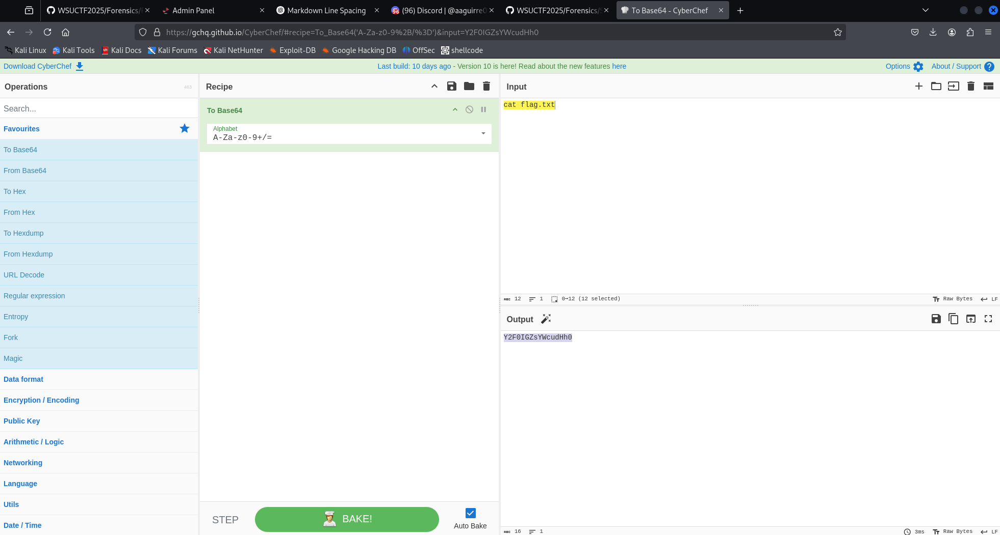
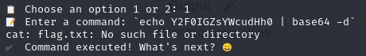
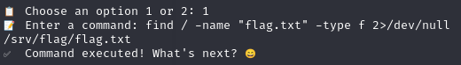
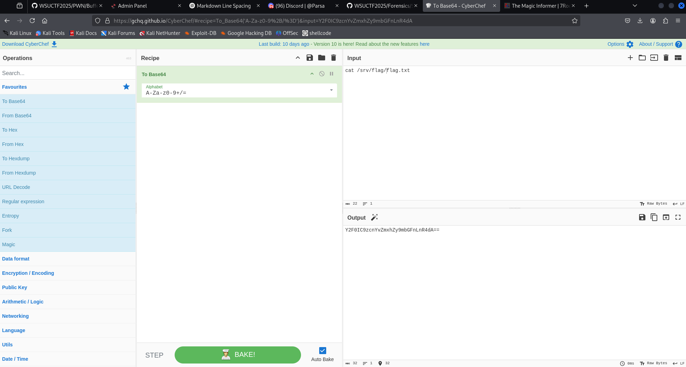
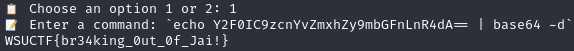
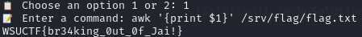
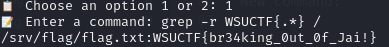

# 🏴 Jailbreak

> **Category:** Pwn
>
> **Points:** 15 pts
>
> **Author:** Sebastian
>
> **Description:** Can you break out of my minimal jail that I have set up? I hope I designed it to be secure enough to keep all secrets outside and all ctf players inside.

---

## Purpose

The purpose of this challenge was to allow the ctf player to run shell commands inside of a shell, and find a way to bypass a blacklist of "bash", "sh", and "cat" commands in order to find the flag, and read it out.

## Exploitation

It is recommended to always decompile binaries when you are given them in PWN challenges, so you can understand exactly what the executable is doing before you even run the file. In this challenge, I only gave the C file, so you can't decompile the actually executable file, but typically, you would use [Ghidra](https://github.com/NationalSecurityAgency/ghidra) to decompile a vulnerable linux ELF executable.

After looking into the C file, there is only one vulnerable function, and that is the run_command function. This function calls the is_dangerous function which includes a blacklist for any commands with the string sequence "cat" or "sh" in it.

```C
int is_dangerous(const char *input) {
    const char *blacklist[] = {
        "cat", "sh"
    };
    int num_blacklist = sizeof(blacklist) / sizeof(blacklist[0]);

    for (int i = 0; i < num_blacklist; i++) {
        if (strstr(input, blacklist[i]) != NULL) {
            return 1;
        }
    }
    return 0;
}
```

This means that any string that has either "cat" or "sh" in it will be blocked. This also includes strings like "bash" where "sh" is part of the word.

What I tried doing first is looking for alternatives to using cat to read a file. Typically in jail challenges like this, the flag is in a file, but it could have a completely different name than flag.txt.

My first idea was to use a bash injection to try to cat flag.txt out. Bash injection works by running ````\`\```` or ```$()``` with commands inside. Bash will interpret whatever is inside of those marks as an actual command, and will attempt to execute that command as bash. So if you base64 encode the command, then base64 decode it inside of these bash injecting symbols, you can run the actual command as if it was actual command in the first place.

This is a good writeup on solving a web challenge that uses this type of bash variable interpolation.

[7rocky writeup](https://7rocky.github.io/en/ctf/htb-challenges/web/the-magic-informer/)

So in the exploitation, you can do something similar to what he did, and wrap the echo command in bacticks, then echo out base64 text and pipe it to base64 -d, and wrap the output of that in $() or ``. This is what I tried:



```
`echo Y2F0IGZsYWcudHh0 | base64 -d`
```



This gave me an error saying that flag.txt isn't in the current directory. So the next thing you can try is to try finding a file with the name of flag.txt.
You can use the find command to find a file with a specific name.

```
find / -name flag.txt -type f 2>/dev/null
```



We can see the flag is located in /srv/flag/flag.txt, and if we modify the base64 encoded echo command, we can get the flag.



New command:

```
`echo Y2F0IC9zcnYvZmxhZy9mbGFnLnR4dA== | base64 -d`
```



There are also other ways to get the flag that don't utilize this trick with bash interpolation.

**Option 2**

Once you find the location of the flag, you can use awk to print it out instead of cat.

New command:

```
awk '{print $1}' /srv/flag/flag.txt
```



**Option 3**

Do a recursive grep on the filesystem for the flag format WSUCTF{}:

New command:

```
grep -r WSUCTF{.*} /
```



## Solution

[Solution](./echoSolution.png)

flag: ```WSUCTF{br34king_0ut_0f_Jai!}```