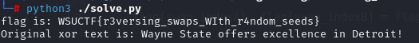

# 🏴 Reversing Randomness

> **Category:** Programming
>
> **Points:** 10 pts
>
> **Author:** Sebastian
>
> **Description:** Can you reverse these random swaps to get the flag?

---

## Purpose

The purpose of this challenge was to reverse random swaps correctly, so that in the future, when encountering this kind of behavior in executables, you are familiar with how to reverse it. Many times reversing challenges will have a vulnerable binary that does a lot of different strange xor and reversing operations. Typically the first step is to identify what the binary is doing, then the second step is to perform the reversing on it to recover the flag.

[This](https://7rocky.github.io/en/ctf/htb-challenges/reversing/alien-saboteaur/) is a good example of a reversing challenge similar to this but also with a binary that you have to decompile and extract:


## Exploitation

In this challenge, we are given an output, along with code that was used to turn an initial flag into that output. In order to solve it, you have to reverse the code that led to the output. Most of the time this is possible. Sometimes when you are swapping and xoring, the bytes that you swap and xor are not reversible. The basis around hashing algorithms is to do lots of rotations and xor which makes them unique and irreversible. In this case, these swaps and xors are reversible, otherwise it wouldn't be possible to get the original flag text.

Whenever you are reversing a for loop, you typically have to reverse the direction of the for loop, and also reverse all of the operations inside of the loop, so you have to put operations that are done last to be done first, and do the reverse of those operations.

So to start off, you could try reversing the order of operations in the reverse.py script by doing something like this:

```py
for _ in range(num_of_swaps):
    indexA = random.randint(0, len(flag) - 1)
    indexB = random.randint(0, len(flag) - 1)

    flag[indexA], flag[indexB] = flag[indexB], flag[indexA]

    for _ in range(num_of_xor_swaps):
        indexA = random.randrange(0, len(flag) - 1, 2)
        indexB = random.randrange(0, len(flag) - 1, 2)

        flag[indexB] = chr(ord(flag[indexB]) ^ ord(xor_text[indexA]))
        xor_text[indexA] = chr(ord(flag[indexB]) ^ ord(xor_text[indexA]))
```

which turns into ->

```py
for _ in range(num_of_swaps):

    for _ in range(num_of_xor_swaps):
        indexA = random.randrange(0, len(flag) - 1, 2)
        indexB = random.randrange(0, len(flag) - 1, 2)

        xor_text[indexA] = chr(ord(flag[indexB]) ^ ord(xor_text[indexA]))
        flag[indexB] = chr(ord(flag[indexB]) ^ ord(xor_text[indexA]))

    indexA = random.randint(0, len(flag) - 1)
    indexB = random.randint(0, len(flag) - 1)

    flag[indexA], flag[indexB] = flag[indexB], flag[indexA]
```

All we did was reverse the order of the for loops, and reverse the order of the xor. Typically this would work, except for the fact that the randomly generated numbers are all messed up if we do this.

We only know the starting seed of the randomly generated numbers, so we can't start calling the random function for the xors, because those are based on the last random numbers. If you look at the original code, the first random numbers that are generated are for swaps, and then the for loop for xors happens. In our code, the first generated randoms numbers are for xoring the text, and since we start with the same random seed, this random number generation is completely reversed.

In order to fix this, we have to get all of the random numbers before we start this block of code for xoring and swapping. Once we do this, we should get the flag, because this block of code reverses every operation correctly, except the random numbers.

In order to get all of the random numbers, we can have a 2d array of random numbers for xor, and a 1d array of randoms numbers for swapping, and we'll generate these numbers in the exact same way as how the original code did:

```py
seed = 5985

random.seed(seed)

num_of_swaps = random.randint(10, 100)
num_of_xor_swaps = random.randint(10, 100)

swap_indices = []
xor_indices = [[] for _ in range(num_of_swaps)]

for i, _ in enumerate(range(num_of_swaps)):
    swap_indexA = random.randint(0, len(flag) - 1)
    swap_indexB = random.randint(0, len(flag) - 1)

    swap_indices.append((swap_indexA, swap_indexB))

    for _ in range(num_of_xor_swaps):
        xor_indexA = random.randrange(0, len(flag) - 1, 2)
        xor_indexB = random.randrange(0, len(flag) - 1, 2)

        xor_indices[i].append((xor_indexA, xor_indexB))
```

This code sets up two arrays and creates a 1d array for random numbers for swapping, and a 2d array for xoring. Now that we have all of the correct random numbers for xoring and swapping, what we have to do is reverse the two lists, so that when we reverse the block of code above, we are using the correct random numbers, but we are also using the reversed random numbers.

```py
swap_indices = swap_indices[::-1]
xor_indices = [x[::-1] for x in xor_indices][::-1]

```

Then this code is basically the same as the one above, except for the fact that we have already generated the random numbers, and we are just accessing the last ones first.

```py
for i, (swap_indexA, swap_indexB) in enumerate(swap_indices):
    for xor_indexA, xor_indexB in xor_indices[i]:
        
        xor_text[xor_indexA] = chr(ord(flag[xor_indexB]) ^ ord(xor_text[xor_indexA]))
        flag[xor_indexB] = chr(ord(flag[xor_indexB]) ^ ord(xor_text[xor_indexA]))
        
    flag[swap_indexA], flag[swap_indexB] = flag[swap_indexB], flag[swap_indexA]
```

## Solution

If we run all of this together, we get the flag:



flag: ```WSUCTF{iamahacker}```