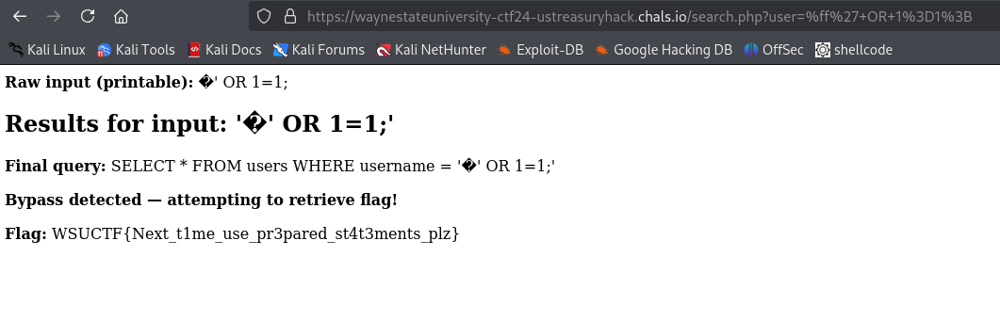

# 🏴 US Treasury Hack

> **Category:** Web  
>
> **Points:** 20 pts  
>
> **Author:** Sebastian  
>
> **Description:** In early march 2025, BeyondTrust -- a provider for remote software support sevices for the US Treasury -- was attacked by a group of Chinese hackers. Can you follow in their footsteps in order to get the flag?

---

## Purpose

The purpose of this challenge was to be more of an OSINT challenge where you have to do some research on how to exploit the BeyondTrust CVE to prevent php's postgres escape string function from escaping strings correctly in a sql injection attack.

## Exploitation

This challenge was more of an OSINT challenge than a web challenge because it was based on exploiting a CVE. If you first look up this vulnerability on the web, you might find pages like [this](https://thehackernews.com/2025/02/postgresql-vulnerability-exploited.html) where you can get the actual CVE for the exploit.

The CVE for the exploit turns out to be [CVE-2025-1094](https://nvd.nist.gov/vuln/detail/cve-2025-1094). This CVE mentions improper quoting syntax allowing a database provider to achieve SQL injection using some of the PostgreSQL escape string functions. PHP is especially vulnerable to this because you can use these functions easily.

This webpage also mentions that the sql escape string function improperly handles multi-byte characters. Afterwards, if we continue to do research, we can find that the vulnerability comes from postgres handling invalid UTF-8 character sequences incorrectly.

The thing that you can exploit in this case is that some utf-8 characters can take multiple bytes, and the postgresql escape string function has a conditional statement that looks at the first byte of text, and ignores escaping the next few bytes if it is a utf-8 multi-byte sequence.

In the end, I got the idea to make this challenge off of this video: [2 bytes was enough](https://www.youtube.com/watch?v=rgsIkZkflMw). I originally was going to give a hint to this video because I thought this could be kind of difficult to find an exploit to this, but I saw that some people were solving this so I decided not to. Sorry if this took a while to find and if you were searching a lot.

In the video, if you enter a byte that is greater than 0xc0, then you enter a ' character to end the postgres string, this will end up working, because the escape string function interprets bytes that start with 0xc0 as multibyte characters, but that isn't always the case. Especially in this scenario, we aren't entering in typical bytes for utf-8 characters, instead we are entering a single quote after this first byte so that postgres ignores this. 

If we look at this code, what we have to do is trick php into not escaping our single quotes, and the program will fetch the flag from the database for us.

```php
$user = pg_escape_string($raw_input);
$query = "SELECT * FROM users WHERE username = '$user'\n";
$result = pg_query($conn, $query);

echo "<div class='container'>";
echo "<h2>Results for input: '" . htmlentities($raw_input) . "'</h2>";
echo "<p><strong>Final query:</strong> " . htmlentities($query) . "</p>";

if (strpos($user, "'") !== false && $raw_input === $user) {
    echo "<p><strong>Bypass detected — attempting to retrieve flag!</strong></p>";

    $flag_result = pg_query($conn, "SELECT flag FROM flags LIMIT 1");
    if ($flag_result && pg_num_rows($flag_result) > 0) {
        $flag_row = pg_fetch_assoc($flag_result);
        echo "<p><strong>Flag:</strong> " . htmlentities($flag_row['flag']) . "</p>";
    } else {
        echo "<p><strong>Error retrieving flag. Please contact an admin.</strong></p>";
    }
}
```

I did this because unfortunately I wasn't able to get the sql injection to actually work when testing this, I was only able to escape the single quote character, but the point is to always use sql prepared statements inside of websites instead of escaping strings like this then passing that output into sql.

## Solution



flag: ```WSUCTF{Next_t1me_use_pr3pared_st4t3ments_plz}```