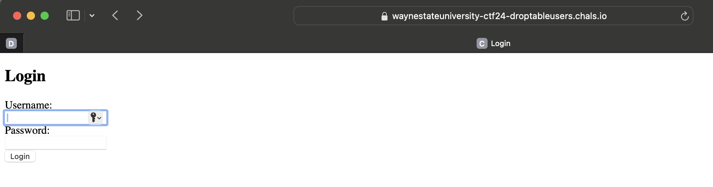
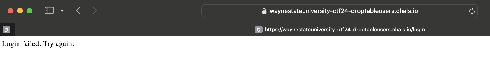
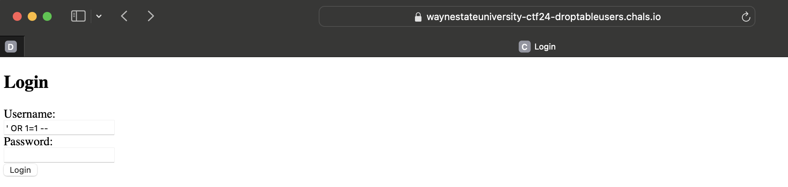
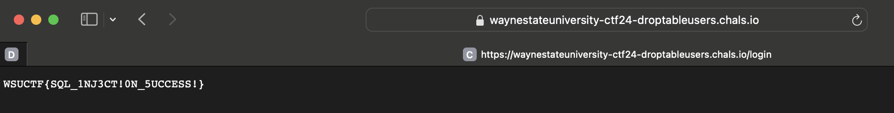

# Drop Me, If You Dare! 

> **Category:** Web Exploitation
>
> **Points:** 10 pts
>
> **Author:** Andrea
>
> **Description:** Can you break into the login page without valid credentials?

---

## Purpose

The goal of this challenge is to demonstrate how an insecure SQL query on a login form can allow an attacker to bypass authentication using SQL Injection. It teaches players how to recognize and exploit common SQL injection vulnerabilities, and understand the importance of proper query sanitization and parameterized inputs.

SQL injection is one of the most well-known web vulnerabilities and is frequently tested in Capture the Flag (CTF) competitions. This challenge gives users hands-on experience identifying the flaw and exploiting it to gain unauthorized access.

## Exploitation

Upon visiting the login page, users are prompted to enter a username and password. 

If you enter incorrect credentials like:

**Username:** `admin`  
**Password:** `wrongpassword`

You’ll get a message like:

**Login failed. Try again.**

However, if you inspect the request being sent or guess the server-side logic, you might notice that the login mechanism uses an SQL query that looks like this:

`SELECT * FROM users WHERE username = '$username' AND password = '$password';`

This type of query is vulnerable if `$username` and `$password` are inserted directly from user input without proper escaping or sanitization.

To exploit it, you can use a classic SQL Injection payload:

**Username:** `' OR 1=1 -- `
**Password:** `[anything]`

The query becomes:
`SELECT * FROM users WHERE username = '' OR 1=1 --' AND password = '[anything]';`

Here, `OR 1=1` always evaluates to true, and `--`comments out the rest of the query. As a result, the database returns the first user in the table (which is the administrator), and you are logged in without needing a real password.

## Solution

Enter the following in the login form:
**Username:** `' OR 1=1 -- `
**Password:** `anything`

If the injection works, you are redirected to a success page and shown the flag.

flag: `WSUCTF{SQL_1NJ3CT!0N_5UCCESS!}`
